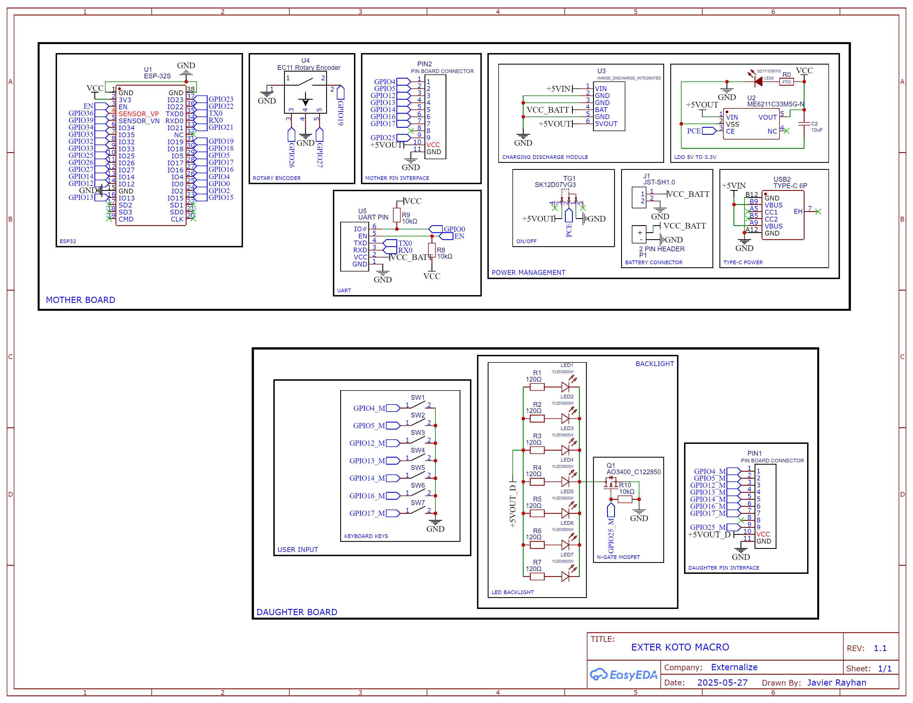
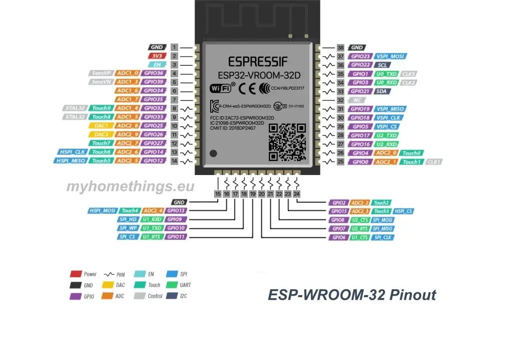

# 🔥 KATO Macro Keyboard with Knob (7 Keys + 1 Rotary Encoder)

**Microcontroller Supported**: ESP32 
**Author**: Javier Rayhan  
**Project Start**: May 16, 2025
**Status**: Stable, but open to improvements

---

## 📌 Project Description

This project is more than just a keyboard, it’s a **compact, powerful, and personal input device** designed to make your daily digital workflows smoother, faster, and a lot cooler. Built with an ESP32 at its heart, this macro keyboard brings together customizability, minimalism, and modern embedded tech, all in one tight, stacked PCB sandwich.

It’s the kind of project that was born out of passion for coding, electronics, and clean user experience. Whether you’re a dev, video editor, gamer, or creative multitasker, this macro pad is your digital sidekick. You define the workflows, it delivers the clicks.

| 🔥 Feature                  | 💬Description                                                                                                   |
|----------------------------- |---------------------------------------------------------------------------------------------------------------- |
| 🎛️ **7 Keys + 1 Knob**      | Minimal but powerful. Map shortcuts, volume, brightness, or anything you want to each key and the rotary knob.  |
| 🧠 **6 Custom Layouts**     | Multiple layers? You got it. Define up to 6 layouts — fully programmable to suit any app or workflow.           |
| 💾 **EEPROM Save**          | Remembers the last brightness level even after reboot. No more resetting your backlight every time.             |
| 💡 **LED Backlight**        | Soft, adjustable lighting to match your vibe or workspace. No RGB spam — just practical and clean.              |
| 💤 **Auto Sleep Mode**      | No device connected? It sleeps after 3 mins to save power. Smart and energy-aware.                             |
| 🔋 **2A Fast Charging**     | Charges quick, runs long. Swappable battery design so you can pick the capacity that fits your needs.          |
| 🔩 **Stacked PCB Design**   | Neat and compact — no 3D case needed. Layered PCBs give structure *and* style.                                 |
| 🧠 **BLE HID Connectivity** | Acts as a Bluetooth HID device — plug and play across Windows, macOS, Linux, even mobile.                      |

###### This project uses an BLE HID by default (based on the current code for generic esp32). Feel free to modified it however you want!

---

## 🧰 Hardware Components

| Component                  | Quantity | Notes                                                                |
|----------------------------|----------|----------------------------------------------------------------------|
| ESP32-WROOM Module         | 1        | Main microcontroller with Wi-Fi + Bluetooth                          |
| AO3400 N-Channel MOSFET    | 1        | Controls LED brightness with PWM                                     |
| EC11 Rotary Encoder        | 1        | Used as a scroll/volume/input knob                                   |
| Hotswap Switch Socket      | 7        | Allows switch replacement without soldering                          |
| 7x LED 0805 (Optional)     | 7        | Per-key backlight LEDs (optional use)                                |
| ME6211 LDO 3.3V Regulator  | 1        | Provides stable 3.3V for ESP32 and components                        |
| USB Type-C 6P (Power Only) | 1        | Power input via USB                                                  |
| Charging/Discharging Module| 1        | 2A capable, supports battery power management                        |
| 120Ω Resistor              | 7        | For LED current limiting                                             |
| 10kΩ Resistor              | 2        | Pull-up resistors for I2C or encoder                                 |
| 10µF Capacitor             | 1        | Power line stabilization                                             |
| LED 1206 (Power LED)       | 1        | Indicates power status                                               |

---

## 🔌 Wiring Schematic

  Pinout Source:  <a href="https://myhomethings.eu/en/esp32-pinout-which-pin-is-for-what/" target="_blank">
  myhomethings.eu, ESP32 PinOut – which pin is for what
  </a>

#### 🔁 EC11 Rotary Encoder
| EC11 Pin | ESP32 Pin | Description            |
|----------|-----------|------------------------|
| Pin 3    | GPIO26    | Encoder A              |
| Pin 5    | GPIO27    | Encoder B              |
| Pin 2    | GPIO19    | Encoder Switch (SW)    |
| Pin 1, 4 | GND       | Ground connection      |

#### ⌨️ Switches
| Switch  | ESP32 Pin |
|---------|-----------|
| SW1     | GPIO4     |
| SW2     | GPIO5     |
| SW3     | GPIO12    |
| SW4     | GPIO13    |
| SW5     | GPIO14    |
| SW6     | GPIO16    |
| SW7     | GPIO17    |

#### ⚡ AO3400 or others N MOSFET
| Pin      | Connection      | Description              |
|----------|-----------------|--------------------------|
| Drain    | LED Cathode     | LED Negative (sink)      |
| Gate     | GPIO25          | PWM control with pulldown|
| Source   | GND             | Ground                   |

#### 💡 LED Backlight Wiring
| Component       | Connection       |
|-----------------|------------------|
| 120Ω Resistor   | Series with LED+ |
| LED Anode (+)   | To 5V via resistor|
| LED Cathode (-) | To MOSFET Drain  |

#### 🔋 ME6211 Voltage Regulator
| Pin  | Connection         | Description                       |
|------|--------------------|-----------------------------------|
| VIN  | 5V Input           | From USB or battery boost circuit|
| CE   | 5V or Switch Ctrl  | Chip enable, tie to 5V or switch  |
| VOUT | 3.3V Output        | Supplies ESP32 and peripherals    |

---

## 📺 Macro Keyboard Photo
##### Curently Unavailable!

---

## ⚠️ Warning and Caution
**Do Not:**
1. Supply above 5V direct to ESP32
2. Short Circuit 
3. Mad if failed, it just matter of time

**Do:**
1. Have fun with your project!
2. Keep you body healthy :D
3. Patient 

### 🛠️Feel free to improve or tweak the code!
I totally welcome any modifications, fixes, or upgrades you wanna make. Just please give a little credit, something like:
**“Original firmware by Javier Rayhan on GitHub”**
…and we’re cool 😄

---
## Any problems?
If anything’s unclear or you’re curious about the project, feel free to slide into my DMs on Instagram: @zv.cpp — always happy to chat!